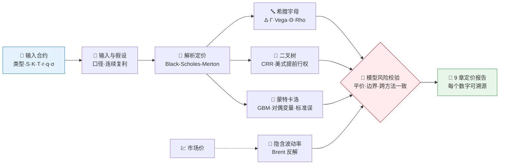
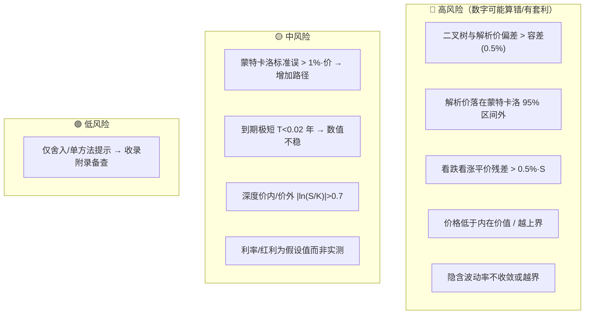

# 🧮 Derivatives Pricing & Stochastic Calculus Skill

**简体中文** | [English](README.en.md)

> 输入一份期权合约与市场参数，输出一份可复现、可校验的定价与风险报告：BSM 解析价、全套希腊字母、二叉树与蒙特卡洛数值价、隐含波动率、看跌看涨平价与无套利校验，一次算清。

<p align="center">
  
  
  
  
  
  
</p>

---

## 📖 这是什么

`derivatives-pricing-stochastic-calculus` 是一个 **Agent Skill**：对单只期权合约做一键定价与风险量化。它把期权定价的核心方法按 **3 条独立路径**并联（解析 / 二叉树 / 蒙特卡洛），叠加 **9 条分级模型风险规则**，最终产出 9 章结构化报告 —— 每个数字都标注所用方法、公式与输入。

它最核心的能力是 **把数字算对、并且证明它对**：一个定价模型只有在多种方法互相吻合、看跌看涨平价成立、价格落在无套利边界内时才可信。本技能默认交叉校验，而不是只给一个闭式解的数字就完事。

> 纯数学、**无需联网、无需行情数据**——只依赖 `numpy` / `scipy`，所以本技能可离线完整运行与验证。

---

## ⚡ 定价流水线



---

## 🗂️ 方法阶段 × 用途映射

| 阶段 | 方法 | 回答什么 |
|---|---|---|
| 🧾 **输入与假设** | 解析合约 · 收集 S/K/T/r/q · σ 或市场价 | 合约与定价输入是什么？口径如何？ |
| 📐 **解析定价** | Black-Scholes-Merton 闭式解 | 欧式期权的无套利价 |
| 🔤 **希腊字母** | BSM 解析导数 Δ/Γ/Vega/Θ/Rho | 风险敏感度与对冲 |
| 🌳 **二叉树** | Cox-Ross-Rubinstein（支持美式） | 美式提前行权？与解析价是否吻合？ |
| 🎲 **蒙特卡洛** | GBM 终值 + 对偶变量 | 独立交叉校验 + 标准误/置信区间 |
| 🔎 **隐含波动率** | Brent 法反解 BSM | 市场价隐含了多少波动率？ |
| 🚨 **模型风险校验** | 看跌看涨平价 · 无套利边界 · 跨方法一致 · MC 标准误 | 实现/输入有没有出错？有没有套利？ |

---

## 🚨 模型风险规则引擎

默认规则一览（可由用户阈值覆盖，缺输入时自动降级为定性提示）：



组合信号会被显式命名，例如 `MC标准误偏大 + 跨方法不一致`、`深度价外 + 隐含波动率不收敛`。完整规则文本与容差见 [`references/pricing-guide.md`](../references/pricing-guide.md)。

---

## 🚀 快速开始

### 1️⃣ 安装

```bash
# 安装运行依赖（纯计算，无需联网）
pip install numpy scipy

# Claude Code（全局）
cp -r skill-derivatives-pricing-stochastic-calculus   ~/.claude/skills/derivatives-pricing-stochastic-calculus

# Codex（全局）
mkdir -p ~/.agents/skills
cp -r skill-derivatives-pricing-stochastic-calculus   ~/.agents/skills/derivatives-pricing-stochastic-calculus

# Cursor（项目级）
mkdir -p .cursor/skills
cp -r skill-derivatives-pricing-stochastic-calculus   .cursor/skills/derivatives-pricing-stochastic-calculus
```

### 2️⃣ 直接用自然语言提问

```text
给一个标的 100、行权 100、一年到期、利率 3%、波动率 20% 的欧式看涨期权定价，并算希腊字母
一份美式看跌期权（S=50, K=55, 半年, σ=30%）值多少？提前行权溢价多少？
某看涨期权市场价 9.5，标的 100 行权 100 一年到期，隐含波动率是多少？
```

### 3️⃣ 不经 Agent 直接跑脚本验证

```bash
cd "Derivatives Pricing & Stochastic Calculus"
python scripts/run_pricing.py --type call --S 100 --K 100 --T 1 --r 0.03 --q 0 --sigma 0.2 --out 定价报告.md
python scripts/run_pricing.py --type put  --S 50  --K 55  --T 0.5 --sigma 0.3 --american 1 --out 美式看跌.md
python scripts/run_pricing.py --type call --S 100 --K 100 --T 1 --sigma 0.2 --market-price 9.5  # 反解隐含波动率
python scripts/run_pricing.py --type call --S 100 --T 1 --sigma 0.2 \
  --strikes 80,90,100,110,120 --market-prices 24.5,16.8,9.5,5.2,2.9  # 波动率微笑/偏斜
```

成功的样子：终端打印 `[done] ... BSM=... | tree=... | MC=...±... | Δ=... | parity=... | top flag=...`，并生成对应 md 报告。

### 4️⃣ 报告结构（固定 9 章）

```
摘要与结论 → 合约与市场输入 → 解析定价 → 希腊字母 → 数值定价与收敛
→ 隐含波动率 → 波动率结构 → 模型风险与校验清单 → 方法附录
```

---

## 📦 目录结构

```
Derivatives Pricing & Stochastic Calculus/
├── SKILL.md                       # 技能入口：工作流、分析规则、质量门槛
├── references/
│   └── pricing-guide.md           # 📒 方法阶段地图、公式、模型风险规则、报告蓝图、QA清单
├── scripts/
│   └── run_pricing.py             # 🐍 可执行骨架：BSM+希腊字母→二叉树→蒙特卡洛→隐含波动率→校验→报告
└── agents/
    └── README.md                  # 📖 本说明文件
```

---

## 📐 核心约束

| 约束 | 说明 |
|---|---|
| 🔁 交叉校验 | 欧式价必须由解析/二叉树/蒙特卡洛三法在容差内互相印证，不靠单一方法下结论 |
| 🧮 公式透明 | d1/d2、各希腊字母、隐含波动率、提前行权溢价、平价残差等都写出公式与输入 |
| 📏 口径明确 | 始终标注希腊字母口径（vega/1vol点、theta/日、rho/1%）与利率是否连续复利 |
| 🚫 无套利 | 校验价格 ≥ 内在价值、≤ 上界，并验证看跌看涨平价，违反即报高风险 |
| 🎲 误差透明 | 蒙特卡洛必须给出标准误与置信区间，不给孤立点估计 |
| 🗣️ 措辞克制 | 用"在95%区间内一致""需增加路径""疑似实现/输入问题"，不下涨跌结论，不用买卖语言 |

---

## ⚠️ 免责声明

本报告基于公开数据与规则化分析生成，仅供研究参考，不构成任何投资建议。

## 📜 License

This project is licensed under the GNU General Public License v3.0. See [LICENSE](LICENSE).
